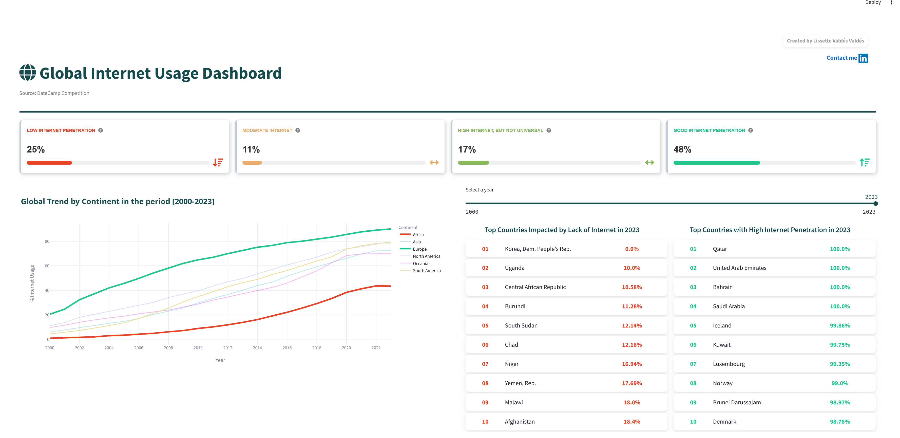
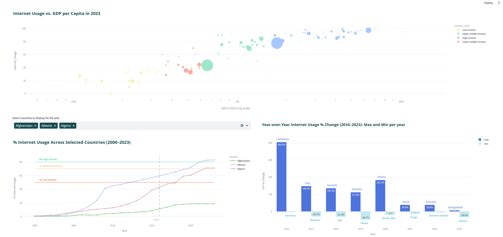

# Global Internet Usage Dashboard

Interactive Streamlit dashboard for exploring worldwide internet usage patterns from 2000 to 2023.

[Live dashboard](https://internet-usage-dashboard-g8anbw2xknjbpb4jgvee69.streamlit.app/) | [GitHub repository](https://github.com/luthien4/internet-usage-dashboard)

This project is part of my Data Analytics and Data Science portfolio. It focuses on data preparation, exploratory analysis, visualization, and communicating global trends through an interactive dashboard.

## Project Overview

The dashboard helps answer questions such as:

- How has internet usage evolved across continents?
- Which countries show the highest and lowest internet penetration?
- How do selected countries compare over time?
- What is the relationship between internet usage and GDP per capita?
- Which countries remain below important internet adoption thresholds?

## Tools Used

- Python
- pandas
- Streamlit
- Plotly
- HTML/CSS for dashboard styling

## Screenshots

### Dashboard overview



### Country comparison and detailed analysis



## Repository Structure

```text
Internet_Usage_Project/
  Data/
    data_longF.csv
    internet_usage_data.csv
    clean_data.csv
  DataCamp_InternetUsage_app.py
  style.css
  README.md
  requirements.txt
  assets/
    dashboard-InternetUsage-screenshot_1.png
    dashboard-InternetUsage-screenshot_2.png
```

## How To Run The Dashboard

1. Clone the repository.
2. Install the dependencies:

```bash
pip install -r requirements.txt
```

3. Run the Streamlit app:

```bash
streamlit run DataCamp_InternetUsage_app.py
```

## Current Status

Portfolio-ready draft. The next improvements will be:

- document the data source more precisely,
- add a short project summary with key findings.

## Author

Created by **Lissette Valdes**.

- GitHub: [github.com/luthien4](https://github.com/luthien4)
- LinkedIn: [lissette-valdes-valdes-b987651](https://www.linkedin.com/in/lissette-valdes-valdes-b987651/)
